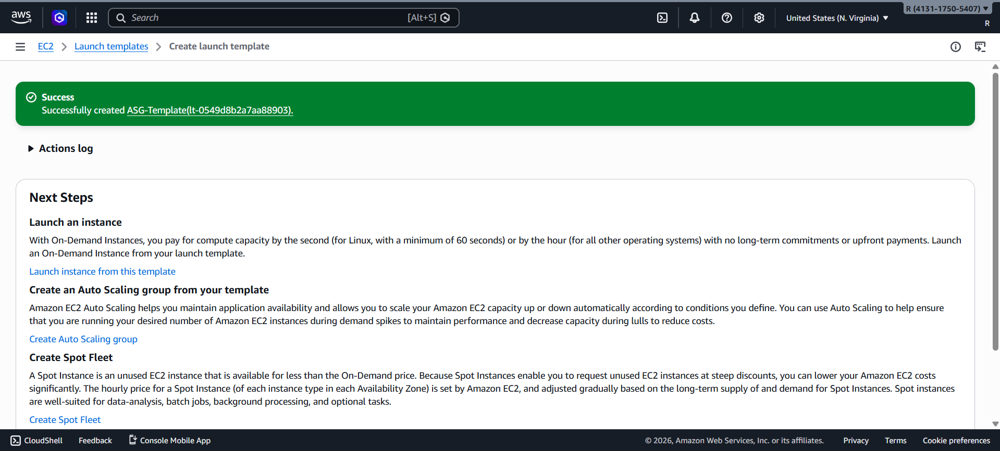
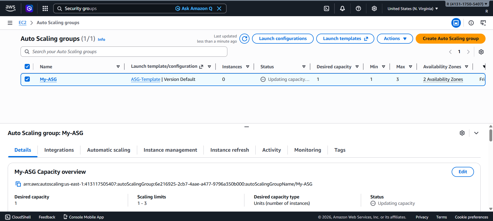
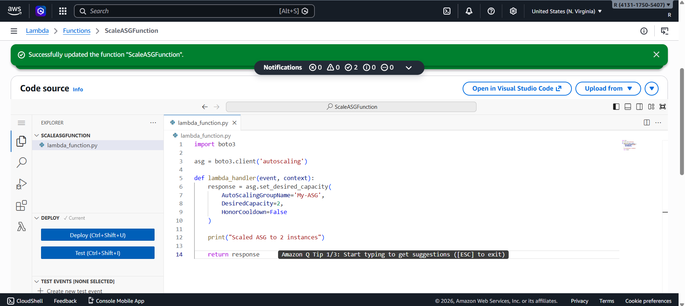
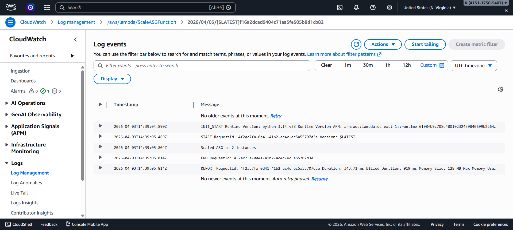
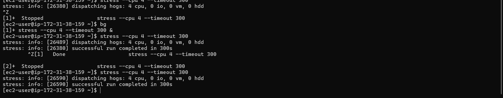
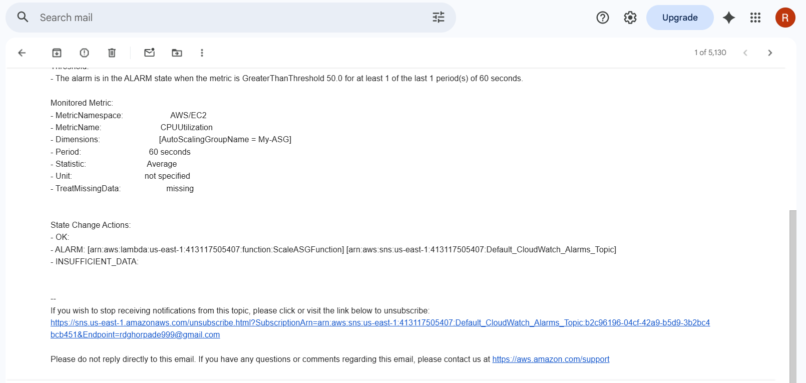

# Automated Incident Response System (AWS)

## Overview

This project monitors CPU usage and automatically scales EC2 instances using AWS CloudWatch, Lambda, and Auto Scaling.

---

## Flow

CloudWatch → Alarm → Lambda → Auto Scaling → New EC2

---

## Steps

### Launch Template

* Create EC2 template (Amazon Linux, t2.micro)

📸 

---

### 2. Auto Scaling Group

* Min: 1 | Desired: 1 | Max: 3

📸 

---

### 3. Lambda Function

```python
import boto3
asg = boto3.client('autoscaling')

def lambda_handler(event, context):
    asg.set_desired_capacity(
        AutoScalingGroupName='My-ASG',
        DesiredCapacity=2,
        HonorCooldown=False
    )
```

📸 

---

### 4. CloudWatch Alarm

* CPU > 50%
* Action → Lambda

📸 

---

### 5. Testing

```bash
stress --cpu 4 --timeout 300
```

📸 

---

## Proof

### Alarm Config


### Lambda Code


### Trigger



---

## Structure

```
project/
├── README.md
├── lambda-code/
├── screenshots/
└── architecture/
```

---

## Conclusion

System automatically scales when load increases → high availability 
